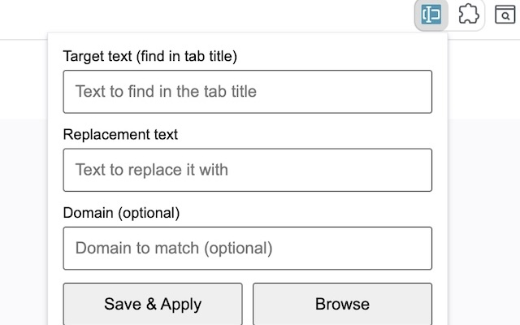
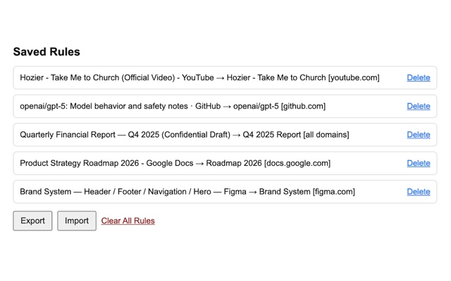

# Simple Tab Renamer (Chrome Extension)

Replace matching text in your open tab titles (using simple “find → replace” rules) and keep those rules after browser restart.

This is handy for shortening noisy titles like:

- `Something · GitHub` → `Something`
- `… - YouTube` → `…`
- Long internal doc titles → short, scannable labels

---

## Screenshots

### Popup (create a rule)

### Rules list (manage / import / export)

---

## Features

- **Rule-based renaming**: replace a *target text* with a *replacement text*.
- **Optional domain scoping**: apply a rule only on a specific domain (e.g. `github.com`), or leave empty to apply to **all domains**.
- **Optional exact URL scoping**: apply a rule only when the URL (including domain, path, query, hash) matches exactly.
- **Persists rules** using `chrome.storage.local` (survives restarts).
- **Auto-apply** on:
  - extension install
  - browser startup
  - tab creation
  - tab updates (when a page finishes loading / title changes)
- **Rules manager page**:
  - view and delete individual rules
  - **export** rules to JSON
  - **import** rules from JSON
  - clear all rules

---

## How it works (quick overview)

1. You create one or more rules:
   - **Target text**: substring to find in the current `document.title`
   - **Replacement text**: what to replace it with (can be empty)
   - **Domain (optional)**: applies to matching hostnames (including subdomains)
   - **Exact URL (optional)**: match by `domain + pathname + search + hash` (e.g. `docs.example.com/docs/page?tab=api#section`)
2. The extension injects a small script into matching tabs and updates `document.title`.

Note: Some pages can’t be scripted (for example `chrome://` pages). Those will be skipped silently.

---

## Installation (developer mode)

1. Download/clone this repository.
2. Open Chrome and go to: `chrome://extensions`
3. Enable **Developer mode**
4. Click **Load unpacked**
5. Select the project folder (the one containing `manifest.json`)

---

## Usage

### Create a rule
1. Click the extension icon.
2. Fill:
   - **Target text**
   - **Replacement text**
   - *(optional)* **Domain**
   - *(optional)* **Exact URL (include domain)**
3. Click **Save & Apply** to apply immediately to currently open tabs.

### Manage rules
- Click **Browse** in the popup to open the **Saved Rules** page.
- From there you can delete rules, import/export JSON, or clear all rules.

---

## Import / Export format

The Rules page exports a JSON file containing a `rules` array. A demo file is included:

- `demo-rules.json`

During import, rules are sanitized and duplicates are skipped.

---

## License

MIT
